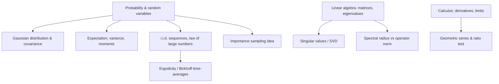
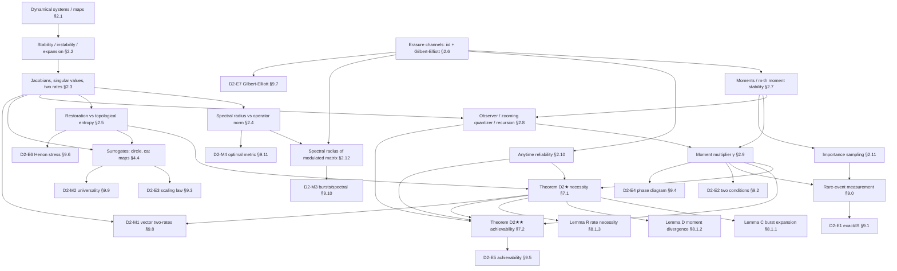

# DEPENDENCY_MAP.md
## Concept prerequisite graphs for Directions 1 and 2

> **Purpose.** This file is *not* an explanation — it is a **prerequisite map**. It shows, for each direction,
> the exact order in which concepts must be mastered, so the two master handbooks
> (`MASTER_D1_HANDBOOK.md`, `MASTER_D2_HANDBOOK.md`) can be turned into a structured, step-by-step course.
> Each node is a concept; an arrow `A → B` means "understand A before B." Section references point into the
> handbooks. The two directions are independent (they share only generic math prerequisites), so they are
> mapped separately, then a small shared-foundations block is given.
>
> **How to use.** Study nodes in *topological order* (any order consistent with the arrows). A node is "ready"
> once all its incoming arrows are satisfied. Theorems depend on their prerequisite concepts; experiments
> depend on their theorem *and* on the specific tools they use.

---

## 0. SHARED MATHEMATICAL FOUNDATIONS (needed by both directions)

These are the generic undergraduate prerequisites both handbooks build on. Master these first.



Linear text form:
```
Probability ─┬─→ Gaussian & covariance
             ├─→ Expectation/variance/moments
             └─→ i.i.d. + Law of Large Numbers ─→ Ergodicity / time-averages
Linear algebra ─┬─→ Singular values (SVD)
                └─→ Spectral radius vs operator norm
Calculus ─→ Geometric series & ratio test
Probability ─→ Importance sampling (idea)
```

---

## 1. DIRECTION 1 — Rate-Constrained Decentralized Detection

### 1.1 Concept dependency graph (Mermaid)

```mermaid
graph TD
    %% information-theory spine
    ENT[Entropy H, I≤H, subadditivity §2.3] --> KL[KL divergence §2.4]
    KL --> MI[Mutual information I(X;Y) §2.5]
    MI --> DPI[Data-processing inequality §2.6]
    KL --> HT[Hypothesis testing + Stein's lemma §2.7]
    HT --> EE[Error exponents + dispersion §2.8]
    MI --> IB[Information Bottleneck θ_IB §2.11]
    DPI --> IB

    %% network spine
    GR[Graphs, cuts, max-flow=min-cut §2.9] --> TE[Time-expanded graphs §2.10]
    TE --> ERGk[Ergodic min-cut Γ_k §2.13]
    GR --> NC[Network coding / RLNC / GF(q) §2.12]

    %% theorems
    IB --> D1star[Theorem D1★ converse §7.1]
    EE --> D1star
    DPI --> D1star
    ENT --> D1star
    ERGk --> D1star
    D1star --> LEMA[Lemma A cut-set §8.1.1]
    D1star --> LEMB[Lemma B rate-limited Stein §8.1.2]

    IB --> D1starstar[Theorem D1★★ achievability §7.2]
    NC --> D1starstar
    TE --> D1starstar
    D1star --> D1starstar

    %% gaussian + experiments
    D1star --> GAUSS[Gaussian closed forms θ_IB, r_UY §8.3]
    IB --> GAUSS
    GAUSS --> SADDLE[Saddlepoint exponent measurement §9.0]
    EE --> SADDLE

    SADDLE --> E1[D1-E1 rate sweep §9.1]
    GAUSS --> E2[D1-E2 converse envelope §9.2]
    ERGk --> E3[D1-E3 topology sufficiency §9.3]
    GAUSS --> E4[D1-E4 water-filling §9.4]
    SADDLE --> E5[D1-E5 scaling §9.5]
    ERGk --> E6[D1-E6 dynamic topology §9.6]
    EE --> E7[D1-E7 dispersion §9.7]
    NC --> N1[D1-N1 genuine network §9.8]
    D1starstar --> N1
    N1 --> N2[D1-N2 large scale §9.9]
    E2 --> N3[D1-N3 discrete converse §9.10]
    GR --> N4[D1-N4 edge cases §9.11]
    NC --> N5[D1-N5 RLNC achievability §9.12]
    D1starstar --> N5
```

### 1.2 Linear (course) order for D1

```
STAGE A — information theory
  1. Entropy (I≤H, subadditivity)            [2.3]
  2. KL divergence                            [2.4]
  3. Mutual information (= KL of joint‖product)[2.5]
  4. Data-processing inequality               [2.6]
  5. Hypothesis testing + Stein's lemma       [2.7]
  6. Error exponents + dispersion V           [2.8]
  7. Information Bottleneck θ_IB               [2.11]   (needs KL, MI, DPI)

STAGE B — networks
  8. Graphs, cuts, max-flow=min-cut           [2.9]
  9. Time-expanded graphs (cycles→acyclic)    [2.10]
 10. Ergodic min-cut Γ_k                       [2.13]  (needs LLN/ergodicity)
 11. Network coding / RLNC / GF(q)             [2.12]

STAGE C — formulation & theorems
 12. Problem formulation + assumptions         [Sec 4]
 13. Theorem D1★ converse                       [7.1]
       ├ Lemma A cut-set                        [8.1.1]  (needs 1,8,9,10)
       └ Lemma B rate-limited Stein             [8.1.2]  (needs 5,6,7,4)
 14. Theorem D1★★ achievability                 [7.2]
       ├ Lemma A-D1 encode/bin over GF(q)       [8.2.1]  (needs 7,11)
       ├ Lemma B-D1 independent-codebook decode [8.2.2]
       └ Lemma C-D1 ergodic cut aggregation     [8.2.3]  (needs 9,10,11)
 15. Gaussian closed forms (θ_IB, r_UY)         [8.3]

STAGE D — measurement & experiments
 16. Saddlepoint exponent measurement          [9.0]   (needs 6,15)
 17. E1 rate sweep → E2 converse envelope       [9.1–9.2]
 18. E3 topology sufficiency → N1 genuine network[9.3, 9.8]
 19. E4 water-filling → E5 scaling → E6 dynamic  [9.4–9.6]
 20. E7 dispersion                              [9.7]
 21. N2 scale, N3 discrete, N4 edges, N5 RLNC   [9.9–9.12]

STAGE E — validation
 22. Validation, audit, FAQ, defense           [Sec 10, 12, 13]
```

### 1.3 The "critical path" (minimum spine to the main theorem)
```
Entropy → KL → Mutual information → Information Bottleneck ─┐
Hypothesis testing → Stein → Error exponents ──────────────┤→ Lemma B ─┐
Graphs/cuts/max-flow → Time-expansion → Ergodic min-cut Γ_k → Lemma A ─┤
                                                                        ↓
                                                          Theorem D1★ (converse)
                                                                        ↓
                     (+ Network coding / RLNC) → Theorem D1★★ (achievability)
                                                                        ↓
                                              E_k = min{E_cen, θ_IB(Γ_k)}
```

---

## 2. DIRECTION 2 — Restoration-Anytime Limit over Lossy Channels

### 2.1 Concept dependency graph (Mermaid)



### 2.2 Linear (course) order for D2

```
STAGE A — dynamics
  1. Dynamical systems / maps                 [2.1]
  2. Stability / instability / expansion       [2.2]
  3. Jacobians, singular values, TWO rates     [2.3]   (r*_top vs r*_vol)
  4. Spectral radius vs operator norm          [2.4]   (needs SVD, eigenvalues)
  5. Restoration vs topological/Lyapunov entropy[2.5]

STAGE B — channel, stability notion, tools
  6. Erasure channels (iid + Gilbert-Elliott)  [2.6]
  7. Moments / m-th-moment stability           [2.7]
  8. Observer / zooming quantizer / recursion  [2.8]   (needs 3,7)
  9. Moment multiplier γ = E[G^m]              [2.9]   (needs 7,8)
 10. Anytime reliability α_ch = ln(1/p)        [2.10]
 11. Importance sampling                       [2.11]
 12. Spectral radius of a modulated matrix     [2.12]  (needs 4,6)

STAGE C — formulation & theorems
 13. Problem formulation + 7 assumptions        [Sec 4]
 14. Surrogates: circle r*=ln k, cat r*=ln λ_u  [4.4]
 15. Theorem D2★ necessity                       [7.1]
       ├ Lemma C burst expansion (sup, not avg) [8.1.1]  (needs 3,5)
       ├ Lemma D moment divergence (series)     [8.1.2]  (needs 6,7,9,10)
       └ Lemma R rate necessity (LLN+counting)  [8.1.3]  (needs 5, LLN)
 16. Theorem D2★★ achievability (UZQ)            [7.2]
       ├ Lemma A-D2 UZQ (shared-index grid)     [8.2.1]  (needs 8)
       ├ Lemma B-D2 drift (Meyn-Tweedie)        [8.2.2]  (needs 9)
       └ Lemma C-D2 cat-map verification        [8.2.3]

STAGE D — measurement & experiments
 17. Rare-event measurement (IS mandatory)      [9.0]   (needs 9,11)
 18. E1 exact/IS → E2 two conditions            [9.1–9.2]
 19. E3 scaling law → E4 phase diagram          [9.3–9.4]
 20. E5 achievability                           [9.5]   (needs 16)
 21. E6 Henon → E7 Gilbert-Elliott              [9.6–9.7]  (needs 5, 6)
 22. M1 vector two-rates                        [9.8]   (needs 3)
 23. M2 universality → M3 bursts/spectral       [9.9–9.10] (needs 12)
 24. M4 optimal metric                          [9.11]  (needs 4)

STAGE E — validation
 25. Validation, audit, FAQ, defense           [Sec 10, 12, 13]
```

### 2.3 The "critical path" (minimum spine to the main theorem)
```
Maps → Instability/expansion → Jacobians / two rates (r*_top, r*_vol) ──┐
Restoration entropy h_R (worst-case, not average) ─────────────────────┤
Erasure channel → Moments → Observer recursion δ_{t+1}=G_t δ_t → γ=E[G^m]┤
Anytime reliability α_ch=ln(1/p) ──────────────────────────────────────┤
                                                                        ↓
                              Theorem D2★ (necessity: conditions R and A)
                                                                        ↓
                     (+ zooming quantizer + drift) → Theorem D2★★ (achievability)
                                                                        ↓
                       γ = (1-p)e^{m(h_R-R)/d+} + p e^{m r*_top} < 1
```

---

## 3. CROSS-DIRECTION NOTES (what is shared, what is NOT)

**Shared (generic) prerequisites only:** probability, Gaussians, i.i.d./LLN, linear algebra (eigenvalues, SVD),
geometric series, ergodicity, importance sampling (idea). Everything past the generic layer is
direction-specific.

**NOT shared (do not confuse):**
- D1's central objects — mutual information, Information Bottleneck $\theta_{\mathrm{IB}}$, min-cut $\Gamma_k$,
  network coding — do **not** appear in D2.
- D2's central objects — expansion rate $r^\star$, restoration entropy $h_R$, erasure probability $p$, moment
  order $m$, the multiplier $\gamma$ — do **not** appear in D1.
- Both use *importance sampling / careful exponent measurement*, but for different reasons: D1 because error
  *exponents* are tiny ($e^{-2n}$, solved by the saddlepoint); D2 because *moments* are rare-event dominated
  (solved by tilted IS).
- The only conceptual *bridge* is an unproven appendix "Conjecture U" (that a belief-update system's restoration
  entropy could lower-bound the D1 rate) — it is **not** used in any theorem of either direction and should be
  treated as speculative.

**Suggested global teaching sequence for a combined course:**
```
Block 0: Shared foundations (§0 above)
Block 1: D1 Stages A–E (information theory → network → theorems → experiments)
Block 2: D2 Stages A–E (dynamics → channel → theorems → experiments)
Block 3: Cross-direction contrast (this section) + open problems of both
```
Teach D1 and D2 as *separate courses* sharing only Block 0; do not interleave their theorems.

---

## 4. QUICK "AM I READY?" CHECKLISTS

**Ready for Theorem D1★ when you can:** define $I(X;Y)$ as a KL divergence; state Stein's lemma; state the
data-processing inequality; compute a min-cut; explain why $I \le H$ and subadditivity bound a cut.

**Ready for Theorem D1★★ when you can:** additionally explain RLNC over $\mathrm{GF}(q)$, why fusion-free =
multicast, and why coding beats routing (butterfly).

**Ready for Theorem D2★ when you can:** define the two expansion rates ($r^\star_{\mathrm{top}}$,
$r^\star_{\mathrm{vol}}$); explain restoration vs topological entropy; write the observer recursion and derive
$\gamma = \mathbb E[G^m]$; sum the geometric series $\sum p^b e^{m r^\star b}$.

**Ready for Theorem D2★★ when you can:** additionally explain the shared-index (mismatch-free) zooming quantizer,
the geometric-drift criterion, and why the cat map needs no quasi-conformality.

**Ready to defend either work when you can:** state precisely what is *proven/closed* vs *conjectured/open* for
that direction (D1: against-independence closed, general-pair open; D2: i.i.d.+uniform closed, bursty+non-uniform
open), and answer the top reviewer questions in Section 12 of the respective handbook.

---

*End of DEPENDENCY_MAP.md. Node references (§x.y) point into `MASTER_D1_HANDBOOK.md` and
`MASTER_D2_HANDBOOK.md`. This map is a prerequisite ordering only; the handbooks contain the actual teaching.*
