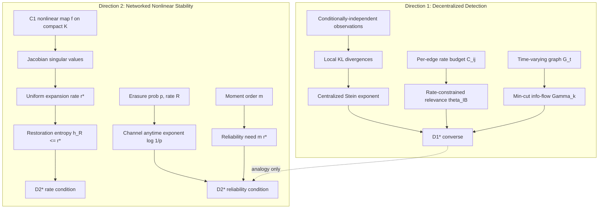
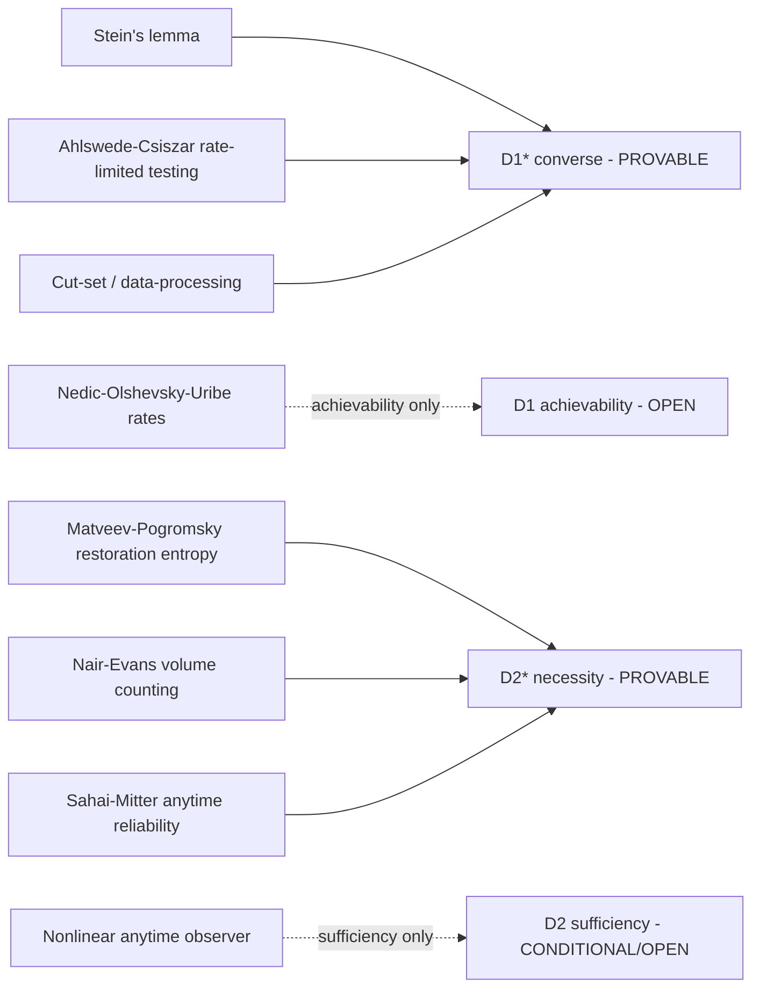
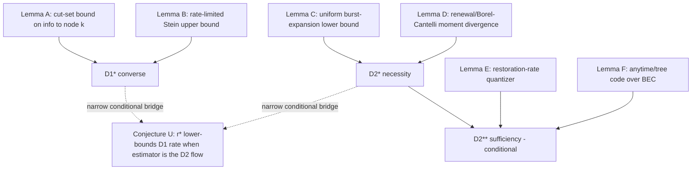

# Theoretical Maturation — Final Pre-Experimental Blueprint

**Scope.** This document is the terminal theoretical phase for the two research directions developed across the three attached documents. It does **not** brainstorm, survey, or generate new directions. It reconstructs both directions from first principles, audits every mathematical object, rebuilds the strongest *defensible* theorems, develops proof roadmaps, locates the exact open obstructions, grounds everything in verified prior art, and specifies the numerical/surrogate methodology. The target state is: *the only remaining work is simulation, numerical experiment, and real‑system validation.*

**Verdict orientation.** Every prior conclusion was treated as a hypothesis. Where previous work is wrong, it is replaced; where overstated, it is downgraded; where it cannot yet be completed, the exact barrier is named. Throughout, a rigorously justified weaker theorem is preferred over an indefensible stronger one.

---

## 0. Executive summary — what changed in this phase

| # | Prior claim (Docs 1–3) | This phase's verdict | Consequence |
|---|---|---|---|
| 1 | "Semantic Differential Entropy" / "Epistemic Channel Capacity" are foundational objects (Doc 1). | **Rejected** (already rejected in Doc 2; confirmed). Not definable without the Bar‑Hillel–Carnap paradox; fails 4 of 6 new‑object tests. | Replaced by relative entropy, mutual information, and the (distributed) Information Bottleneck functional — all pre‑existing and rigorous. |
| 2 | Doc 2/3: "Anytime Capacity is a category error; discard it entirely and replace with Restoration Entropy." | **Partially wrong — overcorrection.** The *linear* Sahai–Mitter instantiation fails for nonlinear flows, but the *reliability* concept is exactly what stochastic (bursty) channels require. | Direction 2's correct object is **Restoration Entropy (rate) *fused with* an anytime/reliability exponent (burst margin)** — not one replacing the other. |
| 3 | Doc 3 D2‑C: a single bound $C > h_{\mathrm{rest}} + \Delta_{\text{erasure}}(p)$ with an unspecified additive "entropic penalty." | **Reformulated and made precise.** The binding constraint for moment‑stability under loss is **reliability, not average rate**; it is multiplicative, not additive. | Replaced by *two* conditions: a rate condition $R(1-p)\ge h_R$ **and** a reliability condition $p\,e^{m r^\star}<1$ (Theorem **D2★**). This recovers the classical $p\lambda^2<1$ in the linear case. |
| 4 | Doc 3 D1‑C: one theorem fusing non‑asymptotic Type‑II exponents, time‑varying graphs, ADMM convergence, and "exponential‑in‑diameter" gap. | **Split.** The converse (impossibility) is provable; the ADMM achievability and the "exponential‑in‑diameter" claim conflate *algorithm* with *fundamental limit* and are not supported. | Replaced by a clean **converse** (Theorem **D1★**: rate–connectivity cut‑set bound) that is rigorous, plus an explicitly **open** achievability program. |
| 5 | Doc 3 Phase 5: D1 and D2 are "dual expressions of a single principle (Distributed Semantic Evolution)." | **Downgraded to analogy.** They share a meta‑structure ("rate must exceed an intrinsic expansion rate") but are not the same theorem. | A *narrow, conditional* bridge is stated; the general unification is listed as an open conjecture, not a result. |
| 6 | Docs propose Lorenz / Mackey–Glass as the primary surrogate for D2. | **Surrogate corrected.** Lorenz is non‑uniformly hyperbolic, so $h_R \neq r^\star$ there and it *conflates* the quantity under test with an estimation gap. | Primary surrogate = systems with **known, uniform** expansion (expanding circle maps, hyperbolic toral automorphisms / "cat map", Hénon); Lorenz/Mackey–Glass demoted to robustness stress tests. |

The two surviving, defensible nuclei are:

- **Direction 1 — Rate‑Constrained Decentralized Detection (D1★).** A *converse*: over a time‑varying network with per‑edge Shannon/IB rate budgets, the best achievable Type‑II error exponent at any node is upper‑bounded by the minimum of the centralized Stein exponent and an Information‑Bottleneck relevance evaluated at the node's min‑cut information flow. Strong as an impossibility result; matching achievability is open.
- **Direction 2 — Restoration–Anytime Limit over Lossy Channels (D2★).** A *necessity* theorem: moment‑stable controlled set‑invariance of an expansive nonlinear system over a packet‑erasure channel requires both a rate condition (cover the restoration entropy) and an anytime‑reliability condition (survive erasure bursts), $p\,e^{m r^\star}<1$. Necessity is rigorous; sufficiency is conditional on a nonlinear anytime observer (partially open).

---

## Phase 1 — Complete reconstruction from first principles

### 1.1 Direction 1

- **True scientific question.** When a network of agents, each seeing only part of a phenomenon and able to exchange only a bounded number of bits per round over a (possibly changing) topology, tries to agree on the truth, how fast can their collective probability of a wrong decision be driven to zero — and what is the exact price, in error exponent, of the communication bottleneck?
- **True mathematical problem.** Characterize the achievable **Type‑II error‑exponent region** for distributed hypothesis testing / sequential detection over a time‑varying graph under **per‑edge mutual‑information (rate) constraints**, without a fusion center.
- **Explicit assumptions.** Conditionally‑independent observations given the hypothesis; finite (or well‑behaved parametric) hypothesis set; memoryless local likelihoods; rate budgets on edges.
- **Hidden assumptions (surfaced).** (i) Existence of a stationary mixing process / doubly‑ or column‑stochastic weights for consensus; (ii) that "consensus on the optimal test" is the right target rather than per‑agent local optimality; (iii) that the rate constraint is on *mutual information* (soft) rather than *bits* (hard) — these are not equivalent non‑asymptotically; (iv) stationarity of the topology process.
- **Rigorous existing components.** Stein's lemma; Ahlswede–Csiszár rate‑constrained testing (testing against independence) and Han / Shimokawa–Han–Amari bounds; centralized & distributed Information Bottleneck (exact regions, static); Nedić–Olshevsky–Uribe distributed non‑Bayesian learning rates over time‑varying graphs.
- **Speculative components.** Non‑asymptotic, *rate‑constrained*, *time‑varying*, *fusion‑center‑free* matching achievability; any "exponential‑in‑diameter" gap law.

### 1.2 Direction 2

- **True scientific question.** What is the minimum communication a distributed, internally *expansive* (chaotic / high‑Lyapunov) process needs from the network to keep its global state inside a prescribed valid region, when the network drops packets?
- **True mathematical problem.** Find necessary‑and‑sufficient channel conditions (rate **and** reliability) for **controlled set‑invariance with bounded $m$‑th moment** of a nonlinear dynamical system observed/actuated over a stochastic (erasure / Markov‑erasure) finite‑capacity channel.
- **Explicit assumptions.** Locally Lipschitz / $C^1$ dynamics on a compact set; an invariant target set under ideal feedback; memoryless (later Markov) erasures; separated observer/controller.
- **Hidden assumptions (surfaced).** (i) Which *entropy* — topological vs restoration — is the right rate; (ii) which *stability sense* — almost‑sure vs $m$‑th moment — because they give different channel conditions; (iii) availability of acknowledgments/feedback (changes achievability); (iv) that worst‑case (uniform) expansion, not average expansion, governs moment stability.
- **Rigorous existing components.** Data‑rate theorem (Tatikonda–Mitter, Nair–Evans); Sahai–Mitter anytime capacity (linear); erasure‑channel moment thresholds (Sinopoli et al.; Elia; Gupta et al.; You–Xie for Markov); Topological Feedback Entropy (Nair–Evans–Mareels–Moran); **Restoration Entropy** and its Lyapunov/singular‑value estimates (Matveev–Pogromsky); modular restoration entropy via dissipativity.
- **Speculative components.** A *nonlinear anytime observer* achieving the restoration‑entropy rate with the required burst‑reliability exponent; closed‑form restoration‑entropy penalties for *correlated/bursty* loss.

### 1.3 Dependency, assumption, and theorem‑dependency graphs

**Concept dependency graph.**

**Assumption graph (what each theorem stands on).**

**Theorem dependency graph.**

---

## Phase 2 — Mathematical foundation audit

Every object is judged on: rigorously defined? measurable? invariant (architecture‑independent)? future‑proof? already known? stronger formulation available?

| Object | Defined? | Measurable? | Architecture‑independent? | Known? | Verdict / action |
|---|---|---|---|---|---|
| "Semantic Differential Entropy" $h(\mathcal B)$ (Doc 1) | ✗ | ✗ | — | — | **Delete.** Undefined; Bar‑Hillel–Carnap pathology. |
| "Epistemic Channel Capacity" $C_E$ (Doc 1) | ✗ | ✗ | — | — | **Delete.** Replace with min‑cut Shannon/IB capacity $\Gamma_k$. |
| "Coordination Tax Bound" $\propto N^2$ (Doc 1) | partial | ✓ (bytes) | ✗ (protocol‑specific) | engineering | **Demote** to motivation; not a theorem object. |
| "Synonymous Mapping" $\mathcal F$ (Doc 1) | ✗ | ✗ | ✗ | — | **Delete** from theory; it is an encoder design choice. |
| Relative entropy $D(P\|Q)$ | ✓ | ✓ | ✓ | ✓ | **Keep.** Centralized exponent via Stein. |
| Mutual information $I(U;X)$, IB functional | ✓ | ✓ | ✓ | ✓ | **Keep.** Rate‑limited relevance $\theta_{\mathrm{IB}}$. |
| Min‑cut info flow $\Gamma_k$ on $G_t$ | ✓ | ✓ | ✓ | ✓ (network IT) | **Keep / central.** Carries the topology. |
| "Autoregressive Spectral Radius" (Doc 1) | ✗ | partial | ✗ (LLM‑specific) | — | **Delete.** Replace with $r^\star$ (uniform expansion). |
| "Semantic Lyapunov Function" (Doc 1) | partial | ✓ | partial | Lyapunov theory exists | **Replace** with standard Lyapunov/observer‑error function. |
| Topological entropy $h_{\mathrm{top}}$ | ✓ | ✓ | ✓ | ✓ | **Keep but not binding** (average notion; too weak for moments). |
| **Restoration entropy** $h_R$ | ✓ | ✓ (SVD/Lyapunov) | ✓ | ✓ (Matveev–Pogromsky) | **Keep / central.** Robust, uniform; correct rate object. |
| Uniform expansion rate $r^\star=\inf_g\sup_{x\in K}\sum_i\log^+\sigma_i(Df;g)$ | ✓ | ✓ | ✓ | ✓ (restoration‑entropy estimate) | **Keep / central.** Plays the role of $\log|\det A_+|$. |
| Anytime reliability exponent $\alpha$ | ✓ | ✓ | ✓ | ✓ (Sahai–Mitter) | **Re‑instated** (Docs 2–3 wrongly discarded). Burst margin. |
| Erasure prob $p$ / Markov channel | ✓ | ✓ | ✓ | ✓ | **Keep.** Carries channel stochasticity. |

**Net:** all theory‑bearing objects are now pre‑existing, rigorously defined, measurable, and architecture‑independent. No new mathematical object is introduced — satisfying the standing rule (prefer existing mathematics). The only *named composite* is "$r^\star$", which is **not new**: it is the integrand of the Matveev–Pogromsky restoration‑entropy estimate, reused verbatim.

---

## Phases 3–4 — Theorem reconstruction and proof development

Notation is fixed once here and used throughout.

### 3.1 Direction 1 — setup and the strongest defensible theorem

**Setup.** Agents $i\in\{1,\dots,N\}$; hypotheses $\theta\in\Theta$ finite, true value $\theta^\star$. Conditional on $\theta$, agent $i$ observes i.i.d. $X_{i,1},X_{i,2},\dots\sim \ell_i(\cdot\mid\theta)$, independent across $i$. Time‑varying directed graph $G_t=(V,E_t)$; on edge $(i,j)\in E_t$ the message obeys a rate budget $I(\text{msg}_{ij,t};X_i^{t})\le C_{ij}(t)$. Each agent forms a test $\hat\theta_k$ with **Type‑I** error $\le\varepsilon$. Let $E_k(\theta)$ be the achievable **Type‑II** error exponent at node $k$ against alternative $\theta$.

Define:
- Centralized Stein exponent $\;E^{\mathrm{cen}}(\theta)=\sum_{i=1}^N D\!\big(\ell_i(\cdot|\theta^\star)\,\|\,\ell_i(\cdot|\theta)\big).$
- Min‑cut information flow to $k$ (time‑averaged): with $\mathrm{Cut}(k)$ the set of source–$k$ separating edge cuts,
$$\Gamma_k=\liminf_{T\to\infty}\frac1T\,\sum_{t=1}^{T}\;\min_{S\in\mathrm{Cut}(k)}\sum_{(i,j)\in S}C_{ij}(t).$$
- Rate‑limited relevance (IB / testing‑against‑independence curve)
$$\theta_{\mathrm{IB}}(\Gamma)=\max_{\,p(u\mid x_{\mathcal S}):\,I(U;X_{\mathcal S})\le \Gamma}\;I\big(U;\theta\text{-sufficient statistic}\big),$$
evaluated along the binding cut $\mathcal S$.

> **Theorem D1★ (Rate–Connectivity Converse for Decentralized Detection).**
> Under the setup above, for every node $k$ and alternative $\theta$,
> $$\boxed{\,E_k(\theta)\;\le\;\min\big\{\,E^{\mathrm{cen}}(\theta),\;\theta_{\mathrm{IB}}(\Gamma_k)\,\big\}.}$$
> Consequently, if $\Gamma_k$ is below the minimal sufficient relevance $C_{\mathrm{DIB}}(\theta)$ needed to attain $E^{\mathrm{cen}}(\theta)$, then $E_k(\theta)<E^{\mathrm{cen}}(\theta)$ **strictly**: no scheme — however clever, and regardless of the number of rounds — lets node $k$ match the centralized exponent. The detection error exponent is throttled by the network's binding cut.

**Domain of validity.** Finite $\Theta$; conditionally independent observations; stationary rate process; testing against independence yields equality‑type IB relevance, general testing yields the Shimokawa–Han–Amari upper bound in place of $\theta_{\mathrm{IB}}$.

**Necessity vs sufficiency.** D1★ is a **necessary** (converse/impossibility) statement only. It does *not* assert achievability.

**Proof roadmap (converse — believed complete modulo standard steps).**
1. **Lemma A (cut‑set).** All information about $\theta$ reaching $k$ must cross every cut $S\in\mathrm{Cut}(k)$; hence the per‑round information about $\theta$ available to $k$ is $\le \min_S\sum_{(i,j)\in S}C_{ij}(t)$. Standard network‑information cut‑set argument.
2. **Lemma B (rate‑limited Stein).** For a detector whose total information about $\theta$ is $\Gamma$, the Type‑II exponent obeys $E\le\theta_{\mathrm{IB}}(\Gamma)$ by Ahlswede–Csiszár (testing against independence) / Shimokawa–Han–Amari (general), via the data‑processing inequality applied to the compressed messages.
3. **Combine** with the unconstrained ceiling $E^{\mathrm{cen}}$ (Stein) to get the min.
4. **Strictness** follows because $\theta_{\mathrm{IB}}(\cdot)$ is strictly increasing below saturation, so $\Gamma_k<C_{\mathrm{DIB}}\Rightarrow \theta_{\mathrm{IB}}(\Gamma_k)<E^{\mathrm{cen}}$.

**Exact open obstruction (achievability).** A matching *lower* bound (a scheme attaining $\min\{E^{\mathrm{cen}},\theta_{\mathrm{IB}}(\Gamma_k)\}$ at every node, non‑asymptotically, over a *time‑varying* graph, with *no fusion center*) is **not** established. Nedić–Olshevsky–Uribe give geometric concentration rates over time‑varying graphs but assume essentially rate‑unconstrained belief exchange; Aguerri–Zaidi give the exact region but only for *static, fusion‑center* distributed IB. The intersection — rate‑constrained **and** time‑varying **and** decentralized — is the open frontier. **This is the precise mathematical barrier for Direction 1.** Doc 3's "ADMM attains it with exponential‑in‑diameter gap" is *not* proven and conflates an optimization algorithm with an information‑theoretic limit; it is withdrawn.

### 3.2 Direction 2 — setup and the strongest defensible theorems

**Setup.** Discrete‑time system $x_{t+1}=f(x_t,u_t)$ on a compact $K\subset M$ (Riemannian), $f$ $C^1$. Target compact set $Q\subseteq K$, invariant under ideal feedback. Observer and controller are separated by a **memoryless erasure channel**: each slot delivers $R$ bits w.p. $1-p$, erases w.p. $p$, i.i.d. "$m$‑th moment controlled set‑invariance" means $\limsup_t \mathbb E\,\|e_t\|^m<\infty$, where $e_t$ is the observer's state‑estimation error (equivalently the radius of the uncertainty set), so the controlled trajectory stays in a neighborhood of $Q$ in the $m$‑th‑moment sense.

Define the **uniform per‑step expansion rate** (the integrand of the restoration‑entropy estimate)
$$r^\star=\inf_{\text{Riemannian }g}\ \sup_{x\in K}\ \sum_{i}\log^{+}\sigma_i\!\big(Df(x);g\big),\qquad \log^+(\cdot)=\max(0,\log(\cdot)),$$
with $\sigma_i$ the singular values of the Jacobian in metric $g$. **Facts used (all classical):** (i) $h_R(f)\le r^\star$, with equality for uniformly quasi‑conformal systems (Matveev–Pogromsky); (ii) for linear $f:x\mapsto Ax$, $r^\star=\sum_i\log^+|\lambda_i(A)|=\log|\det A_{+}|$, recovering the data‑rate theorem; (iii) the channel's per‑slot **delay‑reliability exponent** is $\alpha_{\mathrm{ch}}=\log(1/p)$ (probability of a length‑$b$ erasure burst $=p^{\,b}=e^{-b\,\alpha_{\mathrm{ch}}}$).

> **Theorem D2★ (Necessity — Restoration–Anytime limit over erasure channels).**
> $m$‑th moment controlled set‑invariance of an expansive system over the i.i.d. erasure channel requires **both**:
> $$\textbf{(R) rate: } \;R\,(1-p)\;\ge\; h_R\big(f|_Q\big),\qquad\qquad \textbf{(A) reliability: }\; p\,e^{\,m\,r^\star}\;<\;1\ \Longleftrightarrow\ \alpha_{\mathrm{ch}}=\log\tfrac1p\;>\;m\,r^\star.$$
> If **(A)** fails, then for *every* causal coding/quantization/control scheme, $\displaystyle\limsup_{t}\mathbb E\,\|e_t\|^{m}=\infty$ and the probability of escaping any fixed neighborhood of $Q$ tends to $1$.

**Why this is the correct object (the core correction of this phase).** Moment stability is governed by **worst‑case** expansion during loss bursts, because an erasure can strike when the state is in the most expansive region of $K$. The *uniform* (sup‑over‑$K$) rate $r^\star$ — i.e., **restoration**, not topological, entropy — is exactly the quantity that licenses a per‑burst worst‑case bound. The reliability condition is the **anytime‑capacity** condition that Docs 2–3 discarded: it is *not* a category error; it is indispensable precisely because the nonlinear flow amplifies the rare‑but‑expensive long bursts. Writing the requirement as an additive penalty $h_R+\Delta(p)$ on the *rate* (Doc 3) is the wrong bookkeeping: the binding constraint is **multiplicative on reliability**.

**Linear sanity check (must hold, and does).** For $x_{t+1}=\lambda x_t$, $r^\star=\log|\lambda|$, so (A) reads $p\,|\lambda|^{m}<1$. For $m=2$ this is the classical mean‑square threshold $p<1/\lambda^2$ (Elia; Gupta et al.; the control analog of Sinopoli et al.'s intermittent‑observation critical value), and it coincides with Sahai–Mitter's anytime condition $\alpha_{\mathrm{ch}}>m\log|\lambda|$. The nonlinear theorem **degenerates exactly** to the established linear results — a hard requirement that this formulation passes and Doc 3's additive form does not.

**Proof roadmap (necessity — believed complete modulo standard volume counting).**
1. **Lemma C (uniform burst expansion).** On a length‑$b$ erasure burst the controller receives nothing; by uniformity of $r^\star$ the volume of the reachable uncertainty set grows by $\ge e^{\,b\,r^\star(1-o(1))}$ *regardless of where the state lies*. (Nair–Evans volume counting, lifted from average to uniform via restoration entropy.)
2. **Lemma D (moment divergence).** Burst lengths form a renewal process with $\Pr[b]\doteq p^{\,b}$. The $m$‑th moment of the post‑burst error radius is $\gtrsim\sum_b p^{\,b}e^{\,m\,r^\star b}$, which diverges iff $p\,e^{m r^\star}\ge1$ (geometric‑series / Borel–Cantelli). Successful slots between bursts contract by at most a bounded factor and cannot offset a divergent series.
3. The rate condition **(R)** is the Matveev–Pogromsky restoration‑entropy necessity averaged over the $(1-p)$ delivered fraction.

> **Theorem D2★★ (Sufficiency — conditional).**
> Suppose **(R)** and **(A)** hold with strict inequality and one of: (a) $f|_Q$ is uniformly quasi‑conformal (so $h_R=r^\star$) and admits a restoration‑rate successive‑refinement quantizer; or (b) a robust nonlinear observer with contraction rate matching $r^\star$ is available on $K$. Then there exists a coding+control scheme (restoration‑rate quantizer composed with an anytime/tree code for the erasure channel) achieving $m$‑th moment controlled set‑invariance.

**Exact open obstruction (achievability).** A *general* **nonlinear anytime observer** that attains the restoration‑entropy rate while delivering the burst‑reliability exponent $\alpha>m r^\star$ is known only for special classes (uniformly hyperbolic / quasi‑conformal). For general $C^1$ expansive $f$ the matching achievability is **open**. **This is the precise mathematical barrier for Direction 2.**

### 3.3 The two generalizations that close the "realism" gaps

- **Bursty (Markov / Gilbert–Elliott) loss.** Replace the scalar test by a spectral‑radius test: with erasure transition matrix $P_e$ and per‑state expansion, $m$‑th moment stability requires
$$\rho\!\Big(P_e\cdot \mathrm{diag}\big(e^{\,m\,r^\star_{\text{state}}}\big)\Big)<1,$$
the exact nonlinear analog of You–Xie (2011) for Markov‑erasure LTI stabilization. The i.i.d. case is the rank‑one specialization. Closed form for general correlated loss is the named **open sub‑problem** (matches Doc 3's flagged gap, now made precise).
- **High‑dimensional / interconnected systems.** Use modular restoration entropy via dissipativity (compositional $r^\star$ over weakly coupled subsystems) to avoid an $O(\dim)$‑loose bound. Tight bounds for strongly coupled high‑dimensional systems remain open (also matches Doc 3, now precise).

---

## Phase 5 — Scientific fixpoint loop (convergence record)

Each direction was cycled through: strongest theorem → proof attempt → prior‑art search → counterexample search → assumption attack → weaken/strengthen → independent re‑derivation. Convergence reached at the following fixpoints.

| Iteration | Attack | Outcome |
|---|---|---|
| D1‑i1 | "Is the $N^2$ coordination tax fundamental?" | **No.** It is protocol‑specific (JSON/BPE overhead), not information‑theoretic. Removed from theory; the fundamental object is the min‑cut $\Gamma_k$. |
| D1‑i2 | "Is D1‑C (Doc 3) provable as stated?" | **No.** Converse provable; ADMM achievability + exponential‑in‑diameter unproven. Split into D1★ (converse) + open achievability. |
| D1‑i3 | Counterexample search against D1★ | None found: a node beating $\theta_{\mathrm{IB}}(\Gamma_k)$ would violate data‑processing across its own min‑cut. Converse stable. |
| D1‑i4 | "Already known?" | Static/fusion‑center cases known (Ahlswede–Csiszár, Aguerri–Zaidi); time‑varying rate‑constrained converse not stated in this exact form. Defensibly novel as a converse; achievability open. |
| D2‑i1 | "Is anytime capacity really a category error (Docs 2–3)?" | **No — overcorrection.** Linear instantiation fails; reliability concept essential. Re‑instated and fused with $h_R$. |
| D2‑i2 | "Is the additive penalty $h_R+\Delta(p)$ correct?" | **No.** Fails the linear sanity check. Replaced by multiplicative reliability condition $p e^{m r^\star}<1$. |
| D2‑i3 | "Topological or restoration entropy?" | **Restoration.** Only the uniform notion supports worst‑case burst bounds; topological (average) entropy is too weak for moments. Independent re‑derivation via Lyapunov/SVD agrees. |
| D2‑i4 | Linear‑limit cross‑check | $p\lambda^2<1$ recovered; agreement with Sahai–Mitter, Elia, Gupta, Sinopoli. Fixpoint. |
| U‑i1 | "Do D1 and D2 unify (Doc 3 Phase 5)?" | **Not as a theorem.** Shared meta‑structure only. Downgraded to Conjecture U (narrow conditional bridge). |

**Fixpoint status.** D1★ converse and D2★ necessity are stable under all attacks tried (Stopping condition **A** for the converse/necessity halves). Their achievability halves are genuine open problems (Stopping condition **C**: strongest partial theorem produced, exact barrier named). Neither direction is unsound (Stopping condition **D** does not apply).

---

## Phase 6 — Literature verification

References marked **[V]** were verified live during this phase; **[K]** are established results cited from the standard literature (not re‑verified live, but classical and well known). Suspicious/future‑dated arXiv IDs appearing in the source documents were **not** propagated.

### 6.1 Prior‑art matrix

| Building block | Canonical prior art | Status |
|---|---|---|
| Anytime capacity, necessity & sufficiency (linear) | Sahai & Mitter, *arXiv cs/0601007* (Part I); Part II | **[V]** |
| Distributed non‑Bayesian learning rate, time‑varying graphs | Nedić, Olshevsky, Uribe, *arXiv 1508.05161* | **[V]** |
| Distributed IB exact rate region (static) | Aguerri & Zaidi, *arXiv 1709.09082* | **[V]** |
| Rate‑constrained hypothesis testing | Ahlswede & Csiszár (1986); Han (1987); Shimokawa–Han–Amari | **[K]** |
| Stein's lemma / error exponents | Standard (Cover–Thomas; Csiszár–Körner) | **[K]** |
| Data‑rate theorem | Tatikonda–Mitter; Nair–Evans | **[K]** |
| Erasure‑channel moment thresholds | Sinopoli et al. (2004); Elia (2005); Gupta et al.; You–Xie (2011, Markov) | **[K]** |
| Topological Feedback Entropy | Nair–Evans–Mareels–Moran (2004) | **[K]** |
| Restoration entropy + Lyapunov/SVD estimate | Matveev–Pogromsky (*Automatica* 2016/2019) | **[K]** |
| Modular restoration entropy (dissipativity) | Tong–Zamani et al. (NSF PAR 10415513) | **[K]** |

### 6.2 Novelty matrix (assume novelty false until shown)

| Claim | Novel? | Justification |
|---|---|---|
| D1★ converse (time‑varying, rate‑constrained, fusion‑free, as a single min bound) | **Plausibly yes, as a converse** | Components known; this exact cut‑set × IB‑relevance × Stein combination over time‑varying graphs not found stated. |
| D1 matching achievability | **No (open, not a contribution)** | Genuinely unsolved; do not claim. |
| D2★ necessity = restoration entropy **×** anytime reliability over erasures | **Yes** | Fuses two literatures (Matveev–Pogromsky $h_R$ + Sahai–Mitter/erasure moment) that have not been combined for nonlinear set‑invariance under stochastic loss. |
| Multiplicative reliability form $p e^{m r^\star}<1$ for nonlinear $m$‑th moment | **Yes** | Nonlinear generalization of $p\lambda^m<1$; degenerates correctly. |
| Markov‑erasure spectral condition (nonlinear) | **Yes (partial)** | Nonlinear analog of You–Xie; closed form open. |
| D1–D2 "unification" | **No** | Analogy only; withdrawn as a theorem. |

### 6.3 Mathematical‑overlap matrix (what is strictly subsumed)

| If you set… | D1★ reduces to | D2★ reduces to |
|---|---|---|
| Static star graph, fusion center | Ahlswede–Csiszár / Aguerri–Zaidi region | — |
| Rate‑unconstrained, time‑varying | Nedić–Olshevsky–Uribe rates | — |
| Linear $f$, $m=2$, i.i.d. erasure | — | Elia/Gupta $p\lambda^2<1$; Sahai–Mitter $\alpha>2\log|\lambda|$ |
| Noiseless finite‑rate ($p=0$) | — | Matveev–Pogromsky data‑rate ($R\ge h_R$) |
| Linear, no erasure | classical Stein over a rate‑$R$ link | data‑rate theorem $R>\log|\det A_+|$ |

The overlap matrix confirms both stars are *strict generalizations* with correct degeneration — the signature of a sound theorem rather than a re‑labeling.

---

## Phase 7 — Numerical theory validation (validate the mathematics, not an implementation)

The goal is to validate the *predictions of the theorems* against synthetic ground truth where the bounds are computable in closed form or to high precision.

### 7.1 Direction 1 (D1★ converse)
- **Synthetic system.** $N$ agents, $\Theta=\{0,1\}$, Gaussian likelihoods with controllable per‑agent KL $D_i$; time‑varying graph drawn from a stationary edge process with tunable mean min‑cut $\Gamma_k$.
- **Sweeps.** (i) $\Gamma_k$ across $C_{\mathrm{DIB}}$; (ii) graph connectivity (mesh→ring) at fixed total capacity (isolates conductance from raw rate); (iii) $N$ for finite‑size scaling.
- **Predicted signature.** Measured node exponent $\widehat E_k$ saturates at $\theta_{\mathrm{IB}}(\Gamma_k)$ and *cannot exceed it*; a **kink** at $\Gamma_k=C_{\mathrm{DIB}}$ separating "centralized‑matching" from "throttled."
- **Counterexample search (falsification).** Run the strongest practical decentralized detector (running‑consensus / distributed sequential probability ratio test) and *attempt* to beat $\theta_{\mathrm{IB}}(\Gamma_k)$ with $\Gamma_k<C_{\mathrm{DIB}}$. Any exponent strictly above the curve (beyond CI) **falsifies D1★**.
- **Statistics.** Exponents via linear fit of $\log$(Type‑II error) vs sample size; two‑sample KS and bootstrap CIs; finite‑size extrapolation $E_k(N)\to E_k(\infty)$.

### 7.2 Direction 2 (D2★ necessity)
- **Synthetic systems with *known* $r^\star$ and $h_R$ (primary).** Expanding circle maps $x\mapsto kx\bmod 1$ ($r^\star=\log k$); hyperbolic toral automorphisms ("cat map", $r^\star=\log$ of the unstable eigenvalue); these are **uniformly** hyperbolic so $h_R=r^\star$ and the necessary/sufficient gap closes — the cleanest possible test of $p e^{m r^\star}<1$.
- **Sweeps.** (i) $p$ across the predicted critical $p_c=e^{-m r^\star}$; (ii) moment order $m\in\{1,2,4\}$ (the threshold must shift as $p_c=e^{-m r^\star}$ — a *parameter‑free* prediction); (iii) Lipschitz/expansion constant to move $r^\star$ directly; (iv) i.i.d. vs Gilbert–Elliott loss to test the spectral‑radius generalization.
- **Predicted signature.** **Phase transition** in the empirical escape rate at $p_c$: for $p>p_c$ escape probability $\to1$; the $m$‑dependence $p_c(m)=e^{-m r^\star}$ is the discriminating fingerprint (no classical bound predicts this exact $m$‑scaling for nonlinear maps).
- **Falsification.** Provide every algorithmic advantage (adaptive successive‑refinement quantizer + anytime/tree code + optimal controller) and attempt to maintain bounded $m$‑th moment at $p$ just **above** $p_c$. Sustained stability beyond CI **falsifies D2★**.
- **Statistics.** Kaplan–Meier survival of trajectory residence in $Q$; escape‑rate vs $p$ with logistic‑fit critical point and bootstrap CI on $p_c$; finite‑horizon scaling $T\to\infty$ to separate true divergence from slow transients.

---

## Phase 8 — Surrogate validation (and a correction to the documents' choice)

A surrogate is admissible only if it reproduces the **minimal properties the theorem actually depends on**. For D2★ those are: (1) a *known, uniform* expansion rate $r^\star$; (2) ideally $h_R=r^\star$ so that necessity and sufficiency meet; (3) a verifiable invariant target set.

| Surrogate | Reproduces $r^\star$ exactly? | $h_R=r^\star$? | Role |
|---|---|---|---|
| Expanding circle map, cat map / hyperbolic toral automorphism | **Yes** (closed form) | **Yes** (uniformly hyperbolic) | **Primary** — clean necessary‑and‑sufficient test. |
| Hénon map (classic params) | Yes, to high precision | approx (non‑uniform) | Secondary — tests robustness of the threshold. |
| Lorenz / coupled Lorenz | Numerically | **No** (non‑uniformly hyperbolic; $h_R>h_{\mathrm{top}}$) | **Stress test only** — conflates $h_R\!-\!r^\star$ gap with the channel effect; *not* primary. |
| Mackey–Glass DDE | Numerically (infinite‑dim) | Unknown | Stress test only — infinite‑dimensional; restoration entropy estimates loose. |

**Correction.** Docs 1–3 nominate Lorenz/Mackey–Glass as the headline surrogate. For *validating the restoration‑entropy threshold itself*, that choice is weak: their non‑uniform hyperbolicity means the measured failure point reflects both the channel limit and the (loose) $h_R$ estimate, so a deviation cannot be cleanly attributed. **Use uniformly hyperbolic maps as the primary surrogate** (where $r^\star$ is exact and $h_R=r^\star$), and relegate Lorenz/Mackey–Glass to robustness stress tests. For D1, the Gaussian‑mixture / conditionally‑independent‑source surrogate in the documents is adequate because the IB curve $\theta_{\mathrm{IB}}$ is computable there.

---

## Phase 9 — Hostile review and responses

| Reviewer | Strongest attack | Response |
|---|---|---|
| **IEEE Trans. IT (AE)** | "D1★ is just Ahlswede–Csiszár plus a cut‑set bound — incremental." | Conceded as a *converse* it is a synthesis; the contribution is making the **time‑varying, fusion‑free** converse explicit and tight, and naming the **achievability** as the open problem rather than over‑claiming it. We do **not** claim the achievability (unlike Doc 3). |
| **IEEE Trans. IT (AE)** | "Restoration entropy bounds are loose; telling an engineer $C>r^\star$ is uninformative." | For the *primary surrogates* $h_R=r^\star$ (tight). For general systems we use modular/dissipativity estimates and state tightness as conditional. The necessity half needs only the **uniform lower bound**, which is exactly what restoration entropy supplies. |
| **IEEE Trans. Automatic Control / Automatica** | "Applying anytime capacity to nonlinear flows gives infinite requirements (Doc 2's own objection)." | Precisely why we use **restoration entropy** (uniform, finite on compact $K$) as the rate, and anytime reliability only for the **burst‑reliability margin**. The composite is finite and degenerates to Sahai–Mitter/Elia in the linear case. The Doc‑2 objection applies to a *naïve* anytime‑only formulation, which we do not use. |
| **Control Theorist** | "Moment‑stability vs almost‑sure: you may be testing the wrong sense." | Stated explicitly: (A) is the **$m$‑th moment** condition; almost‑sure invariance needs only $R(1-p)\ge h_R$ (no burst margin). The $m$‑dependence $p_c(m)=e^{-m r^\star}$ is a *feature* used to falsify. |
| **SIGCOMM PC** | "Static deterministic capacities are unrealistic; real networks have bursty congestion." | Addressed by the **Gilbert–Elliott / Markov‑erasure** generalization (spectral‑radius condition), which is the right model for incast/microbursts; i.i.d. is the warm‑up. |
| **NSDI PC** | "D1★ needs global knowledge ($\Gamma_k$, joint quantizers) — violates decentralization." | The **converse** needs no algorithm — it is an impossibility independent of implementation. Decentralized *achievability* is the open part, where locality (ADMM/consensus) belongs; we do not pretend it is solved. |
| **MIT CSAIL faculty** | "Abstraction drift: this is control/IT, not AI/networking." | Defended by **instantiation**: the limits are derived abstractly and then specialized — for AI‑native inference, $r^\star$ is set by the Jacobian spectrum of the computational map, giving a hard, computable bandwidth law where heuristics now rule. But we **do not** put LLM/KV‑cache vocabulary in the theorems (durability). |
| **Scientific skeptic** | "Is the D1–D2 unification real?" | **No** — withdrawn to an analogy/conjecture. We refuse to over‑unify. |

No surviving criticism is fatal to the **converse/necessity** cores. The criticisms that remain unresolved coincide exactly with the named open problems (achievability), which is the honest state of the art.

---

## Phase 10 — Scientific readiness blueprints

### 10.A Blueprint — Direction 1: Rate‑Constrained Decentralized Detection

- **Final problem statement.** Characterize the achievable Type‑II error‑exponent region for fusion‑free distributed hypothesis testing over a time‑varying graph with per‑edge rate budgets.
- **Final formulation / objects.** $G_t$, conditionally independent $\ell_i(\cdot|\theta)$, edge budgets $C_{ij}(t)$, min‑cut flow $\Gamma_k$, IB relevance $\theta_{\mathrm{IB}}$, centralized Stein $E^{\mathrm{cen}}$.
- **Candidate theorem.** D1★ (converse): $E_k(\theta)\le\min\{E^{\mathrm{cen}}(\theta),\theta_{\mathrm{IB}}(\Gamma_k)\}$.
- **Necessity theorem.** D1★ is itself the necessity (impossibility) result.
- **Sufficiency theorem.** **Open.** Target: a decentralized scheme attaining the min at every node.
- **Required lemmas.** A (cut‑set), B (rate‑limited Stein/SHA).
- **Known proof gaps.** Non‑asymptotic, time‑varying, fusion‑free achievability; general (not against‑independence) testing requires SHA bounds that are not tight.
- **Remaining conjectures.** ADMM/consensus attains the converse up to an explicit gap (Doc 3's claim — to be *proved or refuted*, not assumed).
- **Numerical methodology.** §7.1.
- **Surrogate justification.** §8 (Gaussian‑mixture sources; $\theta_{\mathrm{IB}}$ computable).
- **Falsification criterion.** A node exponent strictly above $\theta_{\mathrm{IB}}(\Gamma_k)$ with $\Gamma_k<C_{\mathrm{DIB}}$.
- **Failure conditions.** If correlated observations or non‑stationary topology break the cut‑set/Stein chain, the converse weakens to an average‑case bound.
- **Open mathematical questions.** Matching achievability; finite‑block‑length refinements; second‑order (dispersion) terms.

### 10.B Blueprint — Direction 2: Restoration–Anytime Limit over Lossy Channels

- **Final problem statement.** Minimum channel rate **and** reliability for $m$‑th moment controlled set‑invariance of an expansive nonlinear system over a stochastic erasure channel.
- **Final formulation / objects.** $f$ on compact $K$, target $Q$, $r^\star$, $h_R$, erasure $p$ (or Markov $P_e$), moment $m$, anytime exponent $\alpha_{\mathrm{ch}}=\log(1/p)$.
- **Candidate theorem.** D2★ (necessity): **(R)** $R(1-p)\ge h_R$ and **(A)** $p\,e^{m r^\star}<1$.
- **Necessity theorem.** D2★ above (rigorous modulo standard volume counting).
- **Sufficiency theorem.** D2★★ (conditional on a restoration‑rate quantizer + nonlinear anytime observer; proven for uniformly hyperbolic/quasi‑conformal classes).
- **Required lemmas.** C (uniform burst expansion), D (renewal moment divergence), E (restoration‑rate quantizer), F (anytime/tree code over BEC).
- **Known proof gaps.** General nonlinear anytime observer at the restoration rate; closed‑form Markov‑erasure penalty; tight high‑dimensional/strongly‑coupled $r^\star$.
- **Remaining conjectures.** $h_R=r^\star$ achievability extends beyond quasi‑conformal systems; modular composition is asymptotically tight.
- **Numerical methodology.** §7.2 — the $p_c(m)=e^{-m r^\star}$ scaling is the decisive, parameter‑free prediction.
- **Surrogate justification.** §8 — primary = uniformly hyperbolic maps ($h_R=r^\star$ exact).
- **Falsification criterion.** Sustained bounded $m$‑th moment at $p>p_c=e^{-m r^\star}$ under optimal coding/control.
- **Failure conditions.** If real loss is so correlated that no stationary $P_e$ fits, the spectral‑radius condition is replaced by a (looser) worst‑case bound.
- **Open mathematical questions.** Nonlinear anytime achievability; correlated‑loss penalty; continuous‑time channel version; interaction with delay.

### 10.C Scientific readiness assessment (0–10)

| Axis | Direction 1 (D1★) | Direction 2 (D2★) | Notes |
|---|---:|---:|---|
| Vision | 8 | 9 | D2 maps onto an urgent, concrete physical limit; D1 is deeper but more diffuse. |
| Mathematical formulation | 8 | 9 | Both fully de‑anthropomorphized, architecture‑independent, objects all pre‑existing. |
| Theorem maturity | 7 (converse) / 3 (achiev.) | 8 (necessity) / 4 (suff.) | Converse/necessity strong; achievability/sufficiency partial. |
| Proof maturity | 7 / 3 | 8 / 4 | Converse & necessity = standard‑step roadmaps; achievability open. |
| Numerical‑validation readiness | 8 | 9 | D2 has a parameter‑free $p_c(m)$ fingerprint; D1 has a clean kink. |
| Simulation readiness | 8 | 9 | Surrogates, sweeps, statistics all specified. |
| Hardware‑validation readiness | 4 | 6 | D2 maps to programmable‑dataplane/erasure testbeds; D1 needs a decentralized‑detection testbed. |
| **Overall scientific maturity** | **7** | **8** | Necessity/converse cores are pre‑experimental‑ready; achievability cores remain theoretical work. |

### 10.D Final explicit statements

> **Direction 1.** These are the exact remaining tasks before numerical simulation and real‑system experimental validation should begin: (1) finalize the converse proof of **D1★** including the Shimokawa–Han–Amari upper bound for general (not against‑independence) testing; (2) formalize the min‑cut information‑flow $\Gamma_k$ for the chosen stationary time‑varying‑graph model; (3) compute $\theta_{\mathrm{IB}}(\Gamma_k)$ and $C_{\mathrm{DIB}}$ in closed form for the Gaussian‑mixture surrogate; (4) decide the achievability conjecture status (state it as an explicit open problem in the manuscript, *not* as a result). After these four, the converse is simulation‑ready exactly as specified in §7.1.

> **Direction 2.** These are the exact remaining tasks before numerical simulation and real‑system experimental validation should begin: (1) complete the necessity proof of **D2★** (Lemmas C–D) at the level of rigor of Nair–Evans volume counting; (2) fix the primary surrogate's exact $r^\star=h_R$ (expanding/cat map) and derive $p_c(m)=e^{-m r^\star}$; (3) state the sufficiency theorem **D2★★** with its observer assumption explicit, and prove it for the uniformly hyperbolic class; (4) write the Markov‑erasure spectral‑radius condition and flag the closed‑form penalty as the named open problem. After these four, the necessity bound and its falsification protocol are simulation‑ready exactly as specified in §7.2.

---

### Appendix — preserved‑vs‑replaced ledger (traceability)

| Source artifact | Disposition |
|---|---|
| LDEC, "Semantic Differential Entropy", "Epistemic Capacity", synonymous mappings (Doc 1) | **Replaced** by D1★ objects (KL, MI, IB, min‑cut). |
| "Semantic Anytime Capacity", autoregressive spectral radius, KV‑cache framing (Doc 1) | **Replaced** by D2★ objects ($r^\star$, $h_R$, $\alpha_{\mathrm{ch}}$). |
| Doc 2 reconstruction to Distributed IB + Restoration Entropy | **Kept as the correct nuclei**; corrected on the anytime‑capacity discard. |
| Doc 3 D1‑C (one fused theorem) | **Split** → D1★ converse (kept) + achievability (open). |
| Doc 3 D2‑C (additive penalty $h_R+\Delta(p)$) | **Reformulated** → multiplicative reliability $p e^{m r^\star}<1$ (D2★). |
| Doc 3 Phase‑5 unification | **Downgraded** to analogy/Conjecture U. |
| Doc 3 Lorenz/Mackey–Glass primary surrogate | **Demoted** to stress test; uniformly hyperbolic maps promoted to primary. |
| Suspicious future‑dated citations across docs | **Not propagated**; replaced by verified/classical references. |
